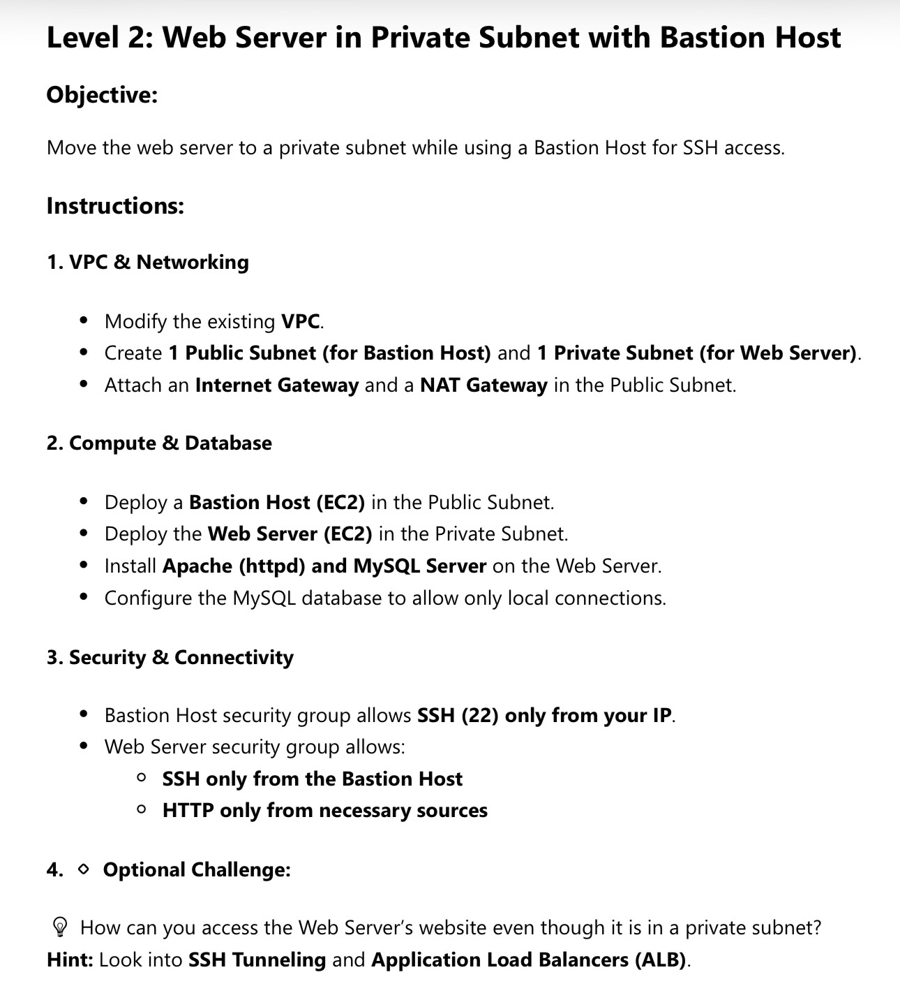

# Level 2: Web Server in Private Subnet with Bastion Host

This project implements an AWS infrastructure with a web server in a private subnet, accessible via a bastion host.

## Assignment



## Infrastructure Details

The infrastructure is managed with Terraform:
- **VPC**: `10.0.0.0/24`
- **Public Subnet**: `10.0.0.0/28` (Bastion Host & NAT Gateway)
- **Private Subnet**: `10.0.0.16/28` (Webserver)

## Usage

### SSH Access
Before connecting, ensure that your SSH agent is running and contains your private key:
```bash
# Start the SSH agent (if not already running)
eval `ssh-agent -s`

# Add your private key
ssh-add <your-key>.pem
```

#### Option 1: SSH ProxyJump (Recommended)
The simplest way to connect is using the `-J` (ProxyJump) flag:
```bash
ssh -J ec2-user@<bastion-host-ip> ec2-user@<webserver-private-ip>
```

#### Option 2: SSH Agent Forwarding
With the key already in your agent, you can use agent forwarding:
```bash
# Connect to the bastion host with agent forwarding enabled
ssh -A ec2-user@<bastion-host-ip>

# From the bastion host, connect to the web server
ssh ec2-user@<webserver-private-ip>
```

### HTTP Access
The web server is in a private subnet. Use an ALB or SSH tunneling to access the web service.
